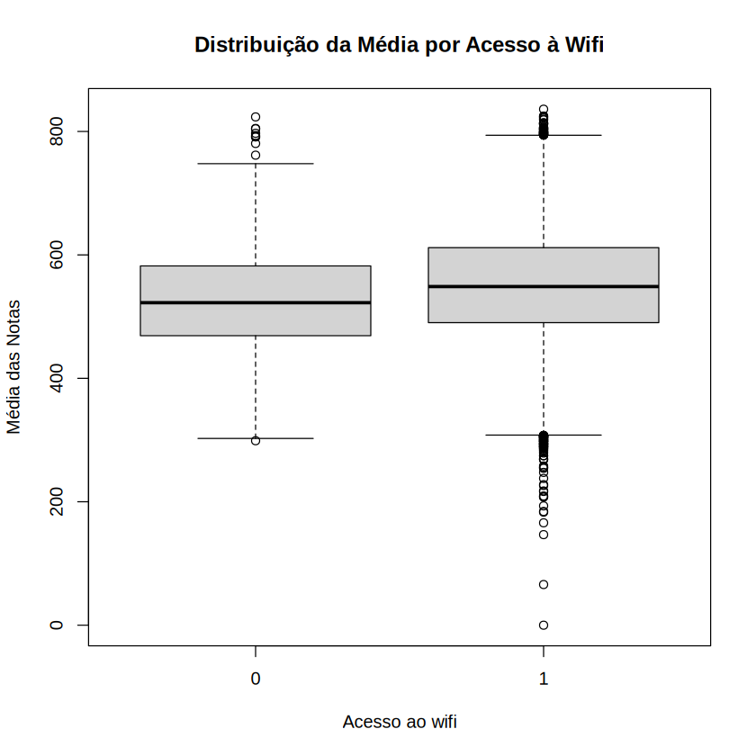
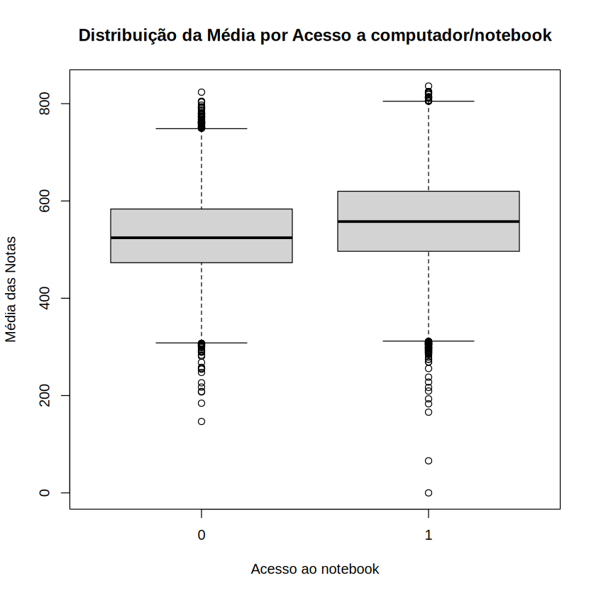
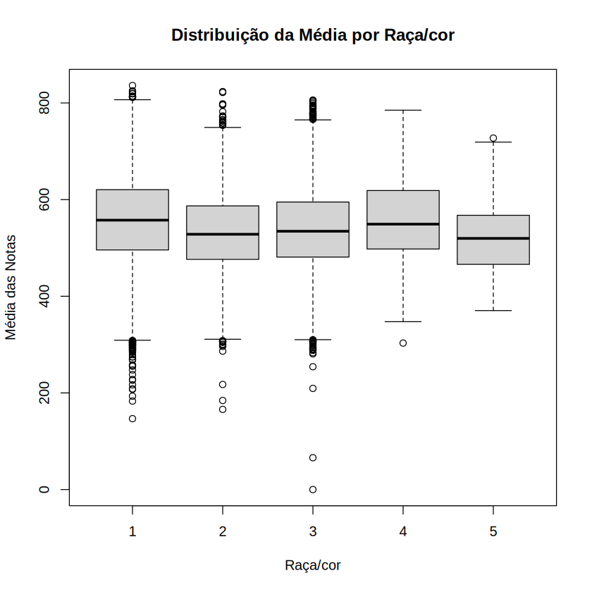

# Análise Exploratória

A etapa de **Análise Exploratória dos Dados (AED)** foi realizada com o objetivo de compreender melhor o conjunto de dados e identificar características que podem ser importantes para as etapas posteriores da análise. Para isso, foram utilizadas **estatísticas descritivas** e **visualizações gráficas**, permitindo observar medidas de tendência central, dispersão e possíveis valores discrepantes (*outliers*).

---

## Estatísticas Descritivas

O conjunto de dados original apresentava cinco notas do ENEM para cada participante:

- `NU_NOTA_CN` — Ciências da Natureza;
- `NU_NOTA_CH` — Ciências Humanas;
- `NU_NOTA_LC` — Linguagens e Códigos;
- `NU_NOTA_MT` — Matemática;
- `NU_NOTA_REDACAO` — Redação.

Como trabalhar individualmente com todas essas notas poderia deixar algumas análises mais complexas, foi criada a variável **`MEDIA`**, calculando a média das cinco notas de cada participante.

A média foi calculada com `rowMeans()`, considerando as cinco notas disponíveis para cada participante. Dessa forma, cada participante passou a ter uma única medida que representa seu desempenho médio no ENEM, facilitando comparações entre diferentes grupos.

Também foi criada a variável **`MEDIANA`**, calculada individualmente para as cinco notas de cada participante. A mediana representa o valor central das cinco notas quando elas são colocadas em ordem crescente.

> **Importante:** a mediana não elimina a menor ou a maior nota. Ela apenas identifica o valor que ocupa a posição central dos dados ordenados. Essa medida é útil porque é menos influenciada por valores extremos do que a média.

Além disso, para uma análise específica envolvendo a nota de Matemática, foi criada a variável **`MEDIA_MT`**. Nessa variável, a média é calculada utilizando Ciências da Natureza, Ciências Humanas, Linguagens e Redação, **sem incluir Matemática**. Isso permite posteriormente comparar o desempenho médio nas demais áreas com o desempenho obtido em Matemática, sem que a própria nota de Matemática participe do cálculo.

---

## Tratamento da variável raça/cor

Para a análise de raça/cor, foram mantidas apenas as categorias de `TP_COR_RACA` que possuem os valores de **1 a 5**.

Em seguida, foi criada a variável binária **`RACA`**. Nela:

- a categoria `1` foi transformada em `FALSE`;
- as categorias `2`, `3`, `4` e `5` foram transformadas em `TRUE`.

Essa transformação permite utilizar a informação de raça/cor em análises que necessitem de uma variável binária.

---

## Medidas de dispersão e identificação de outliers

Após o cálculo da média dos participantes, foi calculado o **desvio padrão** da variável `MEDIA`.

O desvio padrão permite avaliar o quanto as médias dos participantes se afastam, em geral, da média do conjunto. Quanto maior o desvio padrão, maior tende a ser a dispersão dos valores.

Também foram calculados o **primeiro quartil (Q1)** e o **terceiro quartil (Q3)**. Essas medidas dividem a distribuição dos dados em partes e permitem calcular o **intervalo interquartil (IQR)**:

```text
IQR = Q3 - Q1
```

O IQR representa a amplitude dos 50% centrais dos dados, ou seja, a distância entre o primeiro e o terceiro quartil.

A partir dele, foram definidos os limites utilizados para identificar possíveis *outliers*:

```text
Limite inferior = Q1 - 1,5 × IQR
Limite superior = Q3 + 1,5 × IQR
```

Assim, foram considerados possíveis *outliers* os participantes cuja `MEDIA` estivesse abaixo do limite inferior ou acima do limite superior.

Além da quantidade de *outliers*, foi calculado o percentual deles em relação ao número total de participantes com média válida. Esses resultados foram organizados em uma tabela contendo:

- Q1;
- Mediana;
- Q3;
- IQR;
- Limite inferior;
- Limite superior;
- Quantidade de *outliers*;
- Percentual de *outliers*.

Essa etapa é importante para entender a distribuição das médias e verificar se existem valores muito distantes da maior parte dos participantes.

---

# Análise dos Boxplots

Para complementar as estatísticas descritivas, foram utilizados **boxplots**. Esse tipo de gráfico permite comparar a distribuição das médias entre diferentes grupos, mostrando a mediana, os quartis, a dispersão dos dados e possíveis *outliers*.

## Média por acesso à internet via Wi-Fi

O primeiro boxplot compara a distribuição da média das notas entre participantes **com e sem acesso ao Wi-Fi**.



### Interpretação

Observando o gráfico, os dois grupos apresentam distribuições relativamente semelhantes, porém o grupo com acesso ao Wi-Fi (`1`) apresenta uma **mediana da média das notas um pouco maior** do que o grupo sem acesso (`0`).

Também é possível observar uma quantidade considerável de valores considerados *outliers* em ambos os grupos. No grupo com acesso ao Wi-Fi, existem *outliers* tanto abaixo quanto acima da distribuição principal, incluindo alguns valores bastante baixos.

Portanto, visualmente, o acesso ao Wi-Fi está associado a uma distribuição de médias ligeiramente superior, embora o boxplot, sozinho, **não seja suficiente para afirmar que o acesso ao Wi-Fi causa um aumento no desempenho**.

---

## Média por acesso a computador/notebook

O segundo boxplot compara as médias dos participantes de acordo com o **acesso a computador ou notebook**.



### Interpretação

Nesse gráfico, também é possível perceber uma diferença entre os grupos. Os participantes com acesso a computador/notebook (`1`) apresentam uma **mediana das médias superior** à observada entre os participantes sem acesso (`0`).

Além disso, as caixas dos dois grupos apresentam uma dispersão semelhante, embora o grupo com acesso apresente sua distribuição central em valores um pouco mais altos.

Assim como no caso do Wi-Fi, existem diversos *outliers* nos dois grupos. Esses valores indicam participantes com médias muito acima ou muito abaixo da região central da distribuição.

De forma exploratória, o gráfico sugere uma possível relação entre **acesso a computador/notebook e maiores médias**, mas essa observação deve ser analisada com métodos estatísticos apropriados antes de se estabelecer qualquer conclusão.

---

## Média por raça/cor

O terceiro boxplot apresenta a distribuição da média das notas entre as diferentes categorias de **raça/cor**.



### Interpretação

As categorias apresentam distribuições relativamente próximas, mas algumas diferenças podem ser observadas nas medianas.

A categoria `1` apresenta uma das maiores medianas, enquanto as categorias `2`, `3` e `5` apresentam medianas um pouco menores. A categoria `4` possui uma mediana próxima às categorias com valores mais elevados.

Também é possível observar uma quantidade significativa de *outliers* em algumas categorias, principalmente nas categorias `1`, `2` e `3`. Esses valores representam participantes cujas médias estão muito afastadas da região central de seus respectivos grupos.

Apesar das diferenças visuais, existe bastante sobreposição entre as distribuições. Portanto, o boxplot é útil para identificar padrões e levantar hipóteses, mas **não permite concluir sozinho que raça/cor determina o desempenho dos participantes**.

---

# Conclusão da Análise Exploratória

A análise exploratória permitiu transformar as cinco notas individuais do ENEM em uma medida de **média por participante**, tornando as comparações entre grupos mais simples.

As estatísticas descritivas forneceram informações sobre a **tendência central e a dispersão** das médias, enquanto o cálculo dos quartis e do IQR permitiu identificar possíveis *outliers*.

Os boxplots mostraram que participantes com **acesso ao Wi-Fi** e com **acesso a computador/notebook** apresentam, visualmente, medianas de média um pouco superiores às dos participantes sem esses recursos. Já a comparação por **raça/cor** mostrou diferenças entre as categorias, mas também uma grande sobreposição entre as distribuições.

Dessa forma, os resultados da análise exploratória servem principalmente como uma **base para a investigação posterior**. As diferenças observadas nos gráficos podem indicar relações interessantes, mas não devem ser interpretadas como relações de causa e efeito sem a aplicação de análises estatísticas adequadas.
