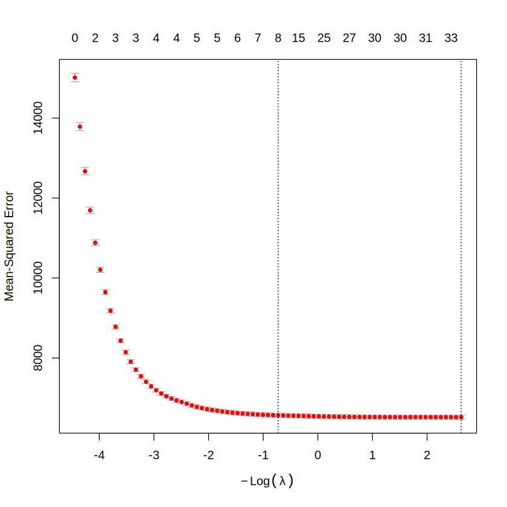

# Consolidação da Análise: Regularização (Lasso e Ridge) — NU_NOTA_MT (ENEM)

## 1. Objetivo

Aplicar **Lasso** e **Ridge**, com validação cruzada e divisão **70/30**, para descobrir **quais variáveis carregam sinal** para prever a nota de matemática (`NU_NOTA_MT`). O Lasso zera o coeficiente das variáveis que não ajudam a prever; o Ridge apenas diminui os coeficientes, sem zerar nenhum, e serve de comparação.

Itens a responder:

- a curva do erro de validação cruzada (a "curva em U");
- o λ escolhido e por quê;
- a lista dos preditores que sobreviveram;
- uma frase com o que o Lasso disse sobre o problema.

| Variável | Papel | Significado |
|---|---|---|
| `NU_NOTA_MT` | Variável prevista | Nota de matemática |
| `MEDIA_MT` | Candidato a preditor | Média das notas do ENEM **sem considerar matemática** |
| `RENDA`, `Q0xx`, `NU_ANO`, `TP_COR_RACA`, notas CN/CH/LC/redação | Candidatos a preditores | Demais colunas do dataset |

---

## 2. Preparação dos dados e divisão 70/30

```r
library(glmnet)

dataset <- na.omit(dataset)

X  <- model.matrix(NU_NOTA_MT ~ . - MEDIA - NU_INSCRICAO - CO_MUNICIPIO_PROVA,
                   data = dataset)[, -1]
yv <- dataset$NU_NOTA_MT

set.seed(1)
idx <- sample(nrow(dataset), 0.7 * nrow(dataset))
```

- **`na.omit`**: o glmnet não aceita valores ausentes. Restaram **35.831 linhas**.
- **`model.matrix`**: o glmnet só aceita matriz numérica, então a função converte o data frame. O `~ .` coloca todas as colunas em X, menos as removidas abaixo.
- **`[, -1]`**: tira a coluna `(Intercept)`, porque o glmnet já inclui o intercepto sozinho.
- **`sample(...)`**: sorteia 70% das linhas para o treino (`idx`); os 30% restantes (`-idx`) formam o teste.
- **Regra do esquema**: a mesma da entrega 5. Tudo que ajusta ou compara modelos (a validação cruzada) usa só o **treino**; o **teste** fica intocado e é usado **uma vez**, no final.

Removemos três colunas de X:

| Coluna | Motivo |
|---|---|
| `MEDIA` | Média das **cinco** notas, incluindo a própria `NU_NOTA_MT`: a resposta já estaria dentro de X |
| `NU_INSCRICAO` | ID do aluno, sem significado como número |
| `CO_MUNICIPIO_PROVA` | Código de município, não é uma quantidade |

Com isso, ficam **35 colunas candidatas** em X.

---

## 3. Dúvida inicial: o erro chegando a zero

Na primeira rodada, com `MEDIA` dentro de X, o erro de validação cruzada caiu para quase **0** e não voltou a subir. Para a nota de uma prova isso não é razoável, então desconfiamos do modelo.

- **Causa**: `MEDIA` é a média das **cinco** notas, inclusive matemática. Como as outras notas também estavam em X, a nota de matemática virava uma conta exata, e o modelo não previa nada, só resolvia uma equação.
- **Solução**: removemos `MEDIA` de X. Depois disso, o erro passou a ficar em um valor realista.

---

## 4. Lasso e Ridge no treino (70%)

```r
set.seed(1)
cvl <- cv.glmnet(X[idx, ], yv[idx], alpha = 1)   # Lasso
set.seed(1)
cvr <- cv.glmnet(X[idx, ], yv[idx], alpha = 0)   # Ridge
plot(cvl)
```

- **`cv.glmnet`**: testa cerca de 100 valores de λ (a força da penalização) e, para cada um, faz validação cruzada de **10 folds** (padrão), medindo o erro nos dados deixados de fora.
- **`alpha = 1`** é o **Lasso**: pode zerar coeficientes, então seleciona variáveis.
- **`alpha = 0`** é o **Ridge**: só diminui os coeficientes, nunca zera.
- **`set.seed(1)` antes de cada um**: os dois modelos usam os mesmos folds, o que torna a comparação justa.
- O glmnet **padroniza** as variáveis internamente antes de penalizar, então a penalização não depende da unidade de cada uma.

---

## 5. A curva de validação cruzada



Como ler o gráfico: o eixo horizontal é −log(λ), então **λ diminui para a direita** e o modelo passa a usar mais variáveis (o número de variáveis ativas aparece no topo).

- À **esquerda** (0 variáveis), o modelo só prevê a média: erro de CV ≈ **15.000**.
- Indo para a direita, o erro **cai rápido** e depois estabiliza em **6.518** (RMSE ≈ 80,7).
- As duas linhas pontilhadas marcam `lambda.1se` (esquerda, **8** variáveis ativas) e `lambda.min` (direita, **33** variáveis ativas).

**A curva não forma um U.** O erro não volta a subir do lado direito, ou seja, usar mais variáveis não piora a previsão. Isso acontece porque temos muitas linhas (35.831) para poucas variáveis (35), então o modelo não chega a se ajustar demais aos dados de treino. Por isso, nesta análise o Lasso serve mais para **escolher variáveis** do que para reduzir o erro.

---

## 6. λ escolhido e por quê

```r
cvl$lambda.min
cvl$lambda.1se
```

| Critério | λ | Variáveis ativas | Erro de CV (MSE) |
|---|:---:|:---:|:---:|
| `lambda.min` | 0,0726 | 33 | 6.518 |
| **`lambda.1se` (escolhido)** | **2,0671** | **8** | pouco acima do mínimo (dentro de 1 erro-padrão) |

Escolhemos o **`lambda.1se`**: o maior λ cujo erro de CV fica a no máximo **1 erro-padrão** do mínimo.

- O erro é quase o mesmo nos dois pontos, mas o `lambda.min` usa 33 variáveis e o `lambda.1se` usa só **8**. Ficamos com o **modelo mais simples**.
- Na parte em que o erro estabiliza, qualquer λ à direita dá um erro quase igual, e o "mínimo exato" não é uma escolha muito firme. A regra de 1 erro-padrão evita depender dele.
- Com menos variáveis fica mais fácil dizer **quais carregam sinal**, que é o objetivo da análise.

---

## 7. Preditores que sobreviveram

```r
cl <- coef(cvl, s = "lambda.1se")
cl[as.vector(cl) != 0, ]
```

```
(Intercept)   11938.1820
NU_ANO           -5.9389
TP_COR_RACA      -0.3464
NU_NOTA_CN        0.5026
NU_NOTA_CH        0.1845
NU_NOTA_LC        0.1419
Q023D            -6.4969
MEDIA_MT          0.3531
RENDA             0.0007
```

| Preditor | Coeficiente | \|r\| com `NU_NOTA_MT` | Leitura |
|---|:---:|:---:|---|
| `MEDIA_MT` | 0,3531 | 0,701 | Quanto maior a média das demais notas, maior a nota de matemática prevista |
| `NU_NOTA_CN` | 0,5026 | 0,675 | Quanto maior a nota de CN, maior a nota prevista |
| `NU_NOTA_CH` | 0,1845 | 0,634 | Mesma leitura, com peso menor |
| `NU_NOTA_LC` | 0,1419 | 0,602 | Mesma leitura, com peso menor |
| `NU_ANO` | −5,9389 | 0,165 | Ajuste pela edição da prova: a nota prevista muda de um ano para outro |
| `RENDA` | 0,0007 | 0,157 | Variável de renda; efeito secundário |
| `TP_COR_RACA` | −0,3464 | 0,091 | Código de cor/raça (1 a 5) tratado como número; efeito muito pequeno |
| `Q023D` | −6,4969 | < 0,1 | Item do questionário socioeconômico; efeito secundário |

As correlações vêm da base inteira e são apenas descritivas.

- **Intercepto**: não é um preditor. Ele fica muito grande porque `NU_ANO` entra como número (ano ≈ 2.000 vezes um coeficiente negativo), e os dois termos se compensam na previsão.
- **Zeradas**: as outras **27** colunas, entre elas `NU_NOTA_REDACAO` (|r| = 0,492) e as `Q007x` e `Q021x`.
- Os coeficientes estão na **unidade de cada variável**, então os tamanhos **não podem ser comparados** entre si. Para ver o peso de cada uma, a correlação é a referência mais segura.

---

## 8. Lasso × Ridge e erro no teste (30%)

```r
c(lasso = min(cvl$cvm), ridge = min(cvr$cvm))

pl <- predict(cvl, X[-idx, ], s = "lambda.1se")
pr <- predict(cvr, X[-idx, ], s = "lambda.1se")

c(lasso = sqrt(mean((yv[-idx] - pl)^2)),
  ridge = sqrt(mean((yv[-idx] - pr)^2)))

sd(yv[-idx])   # referência: erro de "chutar" sempre a média
```

```
MSE de CV:      lasso 6518.07   ridge 6527.79
RMSE no teste:  lasso   79.76   ridge   79.56
Desvio padrão de NU_NOTA_MT no teste: 122.05
```

| Modelo | RMSE de CV (treino) | RMSE no teste | Variáveis no modelo |
|---|:---:|:---:|:---:|
| Lasso (`alpha = 1`) | 80,73 | 79,76 | 8 (em `lambda.1se`) |
| Ridge (`alpha = 0`) | 80,79 | 79,56 | 35 (nenhuma é zerada) |
| Só a média | — | 122,05 | 0 |

- O RMSE no teste (79,76) é parecido com o da validação cruzada no treino (80,73): o desempenho **se mantém em dados novos**.
- **Lasso e Ridge empatam.** Na validação cruzada o Lasso tem erro um pouco menor, e no teste o Ridge ganha por 0,2 ponto: diferenças pequenas demais para apontar um vencedor. O Lasso chega ao mesmo desempenho com 8 variáveis em vez de 35, o que o torna mais fácil de interpretar.
- Em relação a "chutar a média" (122,05), o RMSE de 79,76 é cerca de **35% menor**, o que corresponde a **R² ≈ 0,57** (1 − (79,76 / 122,05)²). O modelo reduz bastante o erro, mas deixa cerca de 43% da variabilidade sem explicar.
- **Comparação com a entrega 5**: lá, `MEDIA_MT` + `RENDA` chegava a RMSE ≈ 86,7 e R² ≈ 0,49. Aqui o RMSE é ≈ 79,8. As divisões 70/30 usam sementes diferentes, então a comparação é aproximada, mas a diferença (≈ 7 pontos) é bem maior que o ganho de 0,3 ponto da `RENDA`. Isso sugere que as notas CN, CH e LC separadas (e o ano) acrescentam informação além da `MEDIA_MT`.

---

## 9. O que o Lasso disse sobre o problema

> Das 35 colunas candidatas, o Lasso (λ pela regra de 1 erro-padrão) manteve apenas 8 e considera que o sinal para `NU_NOTA_MT` está nas notas das outras provas (`NU_NOTA_CN`, `NU_NOTA_CH`, `NU_NOTA_LC`) e na média delas (`MEDIA_MT`), com `NU_ANO`, `Q023D`, `RENDA` e `TP_COR_RACA` como ajustes secundários, zerando todo o resto, inclusive a redação, que tem correlação de 0,49 com matemática, mas cuja informação provavelmente já está dentro da `MEDIA_MT`.

---

## 10. Conclusão geral

- A nota de matemática é prevista, sobretudo, pelo desempenho nas **outras provas**: quem vai bem em uma área tende a ir bem nas demais.
- A `RENDA` sobrevive com peso pequeno, o que combina com a **entrega 5**, em que incluí-la melhorava o RMSE em menos de 0,3 ponto.
- O modelo reduz o erro de "chutar a média" em cerca de 35%, mas deixa parte importante da variação sem explicar (R² ≈ 0,57). Os dados não têm tudo o que importa (preparo do aluno, escola, condições no dia da prova).
- **Cuidados na leitura**:
  - **Variáveis muito correlacionadas entre si**: `NU_NOTA_CN`, `NU_NOTA_CH`, `NU_NOTA_LC` e `MEDIA_MT` trazem informação parecida (a média é calculada a partir das notas). Entre variáveis assim, o Lasso escolhe de forma quase arbitrária, então **não dá para dizer qual das quatro pesa mais**, só que o grupo carrega o sinal.
  - **`NU_ANO` e `TP_COR_RACA` como número**: nesta análise as duas entram como variáveis numéricas, mas são códigos (na entrega 4 foram tratadas como categoria). Por isso o coeficiente único de cada uma, o intercepto tão grande e a falta de interpretação direta de `TP_COR_RACA`.
  - **Sinal não é causa**: o Lasso mostra quais variáveis ajudam a prever, não o que causa a nota.
- Como próximo passo, vale tratar `NU_ANO` e `TP_COR_RACA` como categorias e padronizar X para comparar o peso das variáveis na mesma escala.
